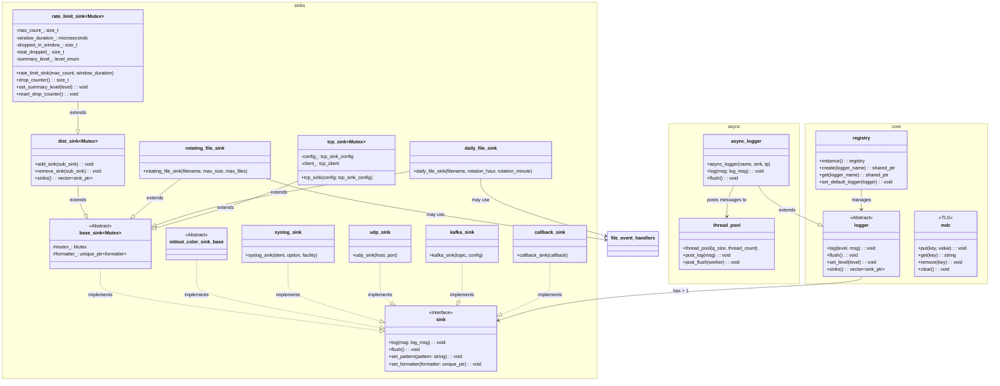
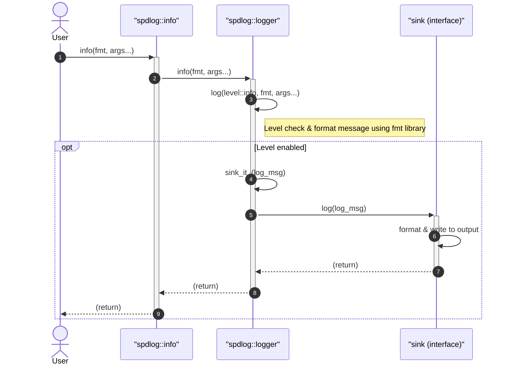
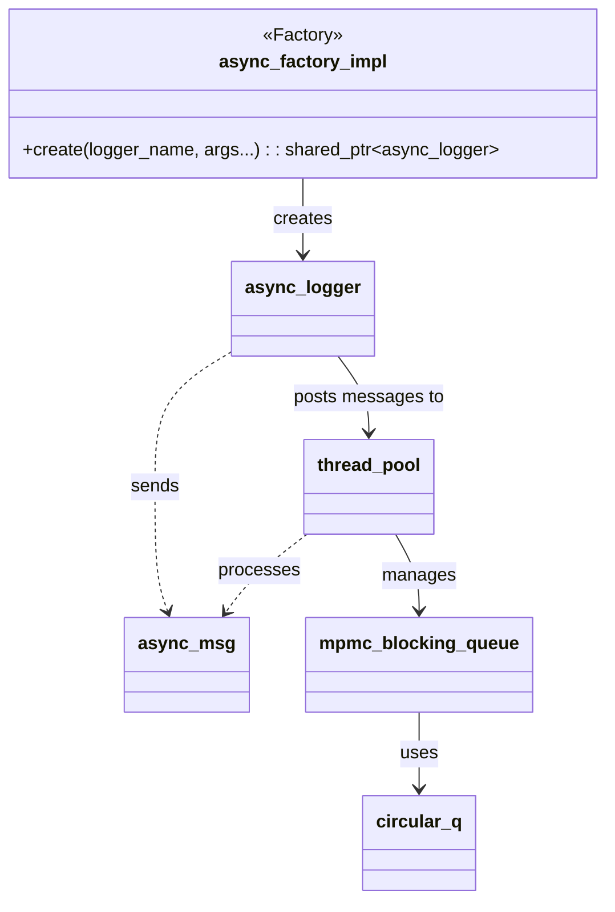

# spdlog: Fast C++ Logging Library


Fast C++ logging library providing a modular architecture for thread-safe log output with support for multiple sinks, custom formatting, and asynchronous logging.

## Architecture

spdlog is built around four primary components that work together to process log messages:

- **Loggers** – The public API through which applications send log messages. Each logger holds a name, a log level, a formatter, and a collection of sinks. The `logger` class (defined in `include/spdlog/logger.h`) manages level filtering, formatting, and dispatching messages to its sinks.
- **Sinks** – Output destinations for log messages. Each sink implements the `sink` interface (defined in `include/spdlog/sinks/sink.h`) and receives fully formatted messages. The library provides a variety of sink implementations for different outputs, including a `rate_limit_sink` that enforces configurable rate limiting by passing at most `max_count` messages per time window and emitting a summary when messages are dropped. Network sinks (`tcp_sink`) implement exponential backoff on reconnection to avoid blocking the calling thread when the server is unavailable. Distribution sinks (`dist_sink`) forward messages to multiple sub-sinks and return a thread-safe copy of the sub-sink list. See the [Sinks Reference](SINKS.md) for details.
- **Formatters** – Responsible for converting log messages into string output. The default `pattern_formatter` (in `include/spdlog/pattern_formatter.h`) supports configurable patterns with flags for time, level, logger name, message, and more. Custom formatters can be created by implementing the `formatter` interface. See [Custom Formatting](CUSTOM_FORMATTING.md) for details.
- **Registry** – A central registry (in `include/spdlog/details/registry.h`) that manages all logger instances, provides global configuration, and handles periodic flushing and thread pool lifecycle. It creates a default logger on initialization.

### Mapped Diagnostic Context (MDC)

The `mdc` class (in `include/spdlog/mdc.h`) provides thread-local key-value pairs that can be included in log output via the `%&` pattern flag. MDC values are stored in thread-local storage and are **not available** to async logger worker threads, since those run on the thread pool. MDC should only be used with synchronous loggers.

### Message Flow

Messages flow through the system as follows:

1. An application calls a logging method on a logger (e.g., `logger->info("message")`).
2. The logger checks the message level against its configured threshold.
3. If the level passes, the logger formats the message using its formatter, producing a string.
4. The formatted message is passed to each attached sink, which writes it to its output destination.
5. For asynchronous loggers, the message is posted to a thread pool queue instead of being processed immediately. A background worker dequeues and forwards the message to the sinks.

The architecture supports both synchronous and asynchronous modes. Synchronous logging blocks the calling thread until the sink writes the message. Asynchronous logging uses a multi-producer, multi-consumer blocking queue (`mpmc_blocking_q`) and a thread pool (`thread_pool`) to decouple the logging call from the I/O operation, reducing latency in the calling thread.

## Sinks


spdlog provides the following sink implementations:

| Sink | Description |
|------|-------------|
| `basic_file_sink` | Simple file output with optional truncation |
| `rotating_file_sink` | File output with size-based rotation |
| `daily_file_sink` | File output with daily rotation at a configurable time |
| `hourly_file_sink` | File output with hourly rotation |
| `stdout_color_sinks` | Colored console output (ANSI on Unix, Win32 API on Windows) |
| `dist_sink` | Distributes messages to multiple sub-sinks |
| `dup_filter_sink` | Filters duplicate messages within a configurable time window, logging a summary of skipped duplicates |
| `rate_limit_sink` | Limits message throughput to at most `max_count` messages per time window; emits a summary and tracks total dropped count |
| `tcp_sink` | Sends log messages to a remote TCP server with exponential backoff reconnection |
| `udp_sink` | Sends log messages to a remote UDP server |
| `syslog_sink` | Writes to the system syslog |
| `systemd_sink` | Writes to the systemd journal |
| `android_sink` | Writes to the Android system log |
| `kafka_sink` | Produces messages to a Kafka broker |
| `mongo_sink` | Writes to a MongoDB collection |
| `msvc_sink` | Writes to the Visual Studio debug output |
| `win_eventlog_sink` | Writes to the Windows Event Log |
| `null_sink` | Discards all messages (useful for benchmarks) |
| `ostream_sink` | Writes to any `std::ostream` |
| `callback_sink` | Invokes a user-provided callback for each message |
| `ringbuffer_sink` | Stores messages in a fixed-size ring buffer for testing |

### Rate Limiting

The `rate_limit_sink` inherits from `dist_sink` and enforces a maximum message count per configurable time window. When the limit is reached, subsequent messages are dropped until the window expires. A summary message is emitted at the configured summary level indicating how many messages were dropped.

Key methods:

| Method | Description |
|--------|-------------|
| `drop_counter()` | Returns the total number of dropped messages |
| `set_summary_level(level)` | Sets the log level used for summary messages |
| `summary_level()` | Returns the current summary log level |
| `reset_drop_counter()` | Resets the drop counter to zero |

Factory functions are provided for convenient creation:

```cpp
// Multi-threaded rate-limited logger (at most 100 messages per second)
auto logger = spdlog::rate_limit_logger_mt("rate_limited", 100, std::chrono::seconds(1));

// Single-threaded variant
auto logger_st = spdlog::rate_limit_logger_st("rate_limited_st", 100, std::chrono::seconds(1));
```

### Duplicate Filtering

The `dup_filter_sink` suppresses repeated identical log messages within a configurable duration. When duplicates are suppressed, a summary message (e.g., "Skipped N duplicate messages..") is emitted at the **highest** severity level observed during the skip window, ensuring the summary is never filtered out by a downstream sink's level threshold.

### TCP Sink Reconnection

The `tcp_sink` uses exponential backoff when reconnecting to a remote server. On connection failure, the delay doubles each attempt from `reconnect_delay_ms` up to `max_reconnect_delay_ms`, preventing the logging thread from being blocked on every message when the server is unavailable.

## Core Classes




## Formatting


spdlog uses the `fmt` library (bundled or external) for formatting log messages. The `pattern_formatter` supports configurable log patterns using format flags:

| Flag | Description |
|------|-------------|
| `%+` | Default logger pattern |
| `%v` | Message text |
| `%t` | Thread ID |
| `%P` | Process ID |
| `%s` | Source filename |
| `%g` | Short source filename |
| `%#` | Source line |
| `%!` | Source function |
| `%^` | Start color range |
| `%$` | End color range |
| `%n` | Logger name |
| `%l` | Log level |
| `%L` | Log level (short) |
| `%T` | Thread name |
| `%H` | Hour (24h) |
| `%M` | Minute |
| `%S` | Second |
| `%F` | Millisecond |
| `%A` | Weekday name |
| `%a` | Weekday name (short) |
| `%b` | Month name |
| `%d` | Day of month |
| `%m` | Month (number) |
| `%Y` | Year |
| `%z` | Timezone offset |
| `%p` | AM/PM |
| `%E` | Thread name (extended) |
| `%&` | MDC key-value pairs |

Custom formatting flags can be registered via `pattern_formatter::add_flag<T>()`.

## Asynchronous Logging




Asynchronous logging decouples the logging call from the actual I/O by using a thread pool with a multi-producer, multi-consumer blocking queue.



### Key Async Components

- **`async_logger`** (`include/spdlog/async_logger.h`) – Extends `logger` and posts messages to a thread pool instead of writing synchronously. Created via `spdlog::async_logger()` or the `async_factory_impl`.
- **`thread_pool`** (`include/spdlog/details/thread_pool.h`) – Owns the blocking queue and worker threads. Supports configurable overflow policies (block, overrun newest, discard oldest).
- **`mpmc_blocking_q`** (`include/spdlog/details/mpmc_blocking_q.h`) – Thread-safe multi-producer, multi-consumer blocking queue. Supports bounded and unbounded modes.
- **`circular_q`** (`include/spdlog/details/circular_q.h`) – Fixed-size ring buffer used internally by the blocking queue for bounded mode.
- **`async_msg`** (`include/spdlog/details/thread_pool.h`) – Lightweight structure that wraps a log message (or flush/terminate signal) for queue transport.

## Configuration


spdlog supports configuration from multiple sources:

- **Environment variables** (`include/spdlog/cfg/env.h`) – Set log levels via the `SPDLOG_LEVEL` environment variable.
- **Command-line arguments** (`include/spdlog/cfg/argv.h`) – Parse log levels from `argv` using the same `SPDLOG_LEVEL` syntax.
- **Configuration strings** (`include/spdlog/cfg/helpers.h`) – Parse level configuration from strings at runtime.

### Global Operations

The registry provides global operations that affect all registered loggers:

```cpp
spdlog::set_level(spdlog::level::debug);          // Set global log level
spdlog::flush_on(spdlog::level::err);             // Flush all loggers on error
spdlog::set_automatic_registration(false);         // Disable auto-registration
spdlog::shutdown();                                // Flush and cleanup
```

## Thread Safety

spdlog provides thread safety at multiple levels:

- **Logger level changes** are atomic and safe to call from any thread.
- **Sink implementations** use `_mt` (multi-threaded) or `_st` (single-threaded) suffixes. `_mt` variants protect `sink_it_()` and `flush_()` with a mutex.
- **The `dist_sink`** base class returns a copy of the sub-sink vector from `sinks()` to prevent data races from unsynchronized external access.
- **The `null_mutex`** (`include/spdlog/details/null_mutex.h`) provides no-op locking for `_st` variants, eliminating synchronization overhead.
- **MDC values** are thread-local and not shared across threads. Async logger worker threads will not see MDC values set on the calling thread.

## Project Structure

```
spdlog/
├── include/spdlog/       # Core headers (public API)
│   ├── cfg/              # Configuration from environment and command-line arguments
│   ├── details/          # Internal implementation (registry, thread pool, file helpers, etc.)
│   ├── fmt/              # Formatting support (bundled fmt library and extensions)
│   ├── sinks/            # Output sink implementations (file, console, syslog, network, etc.)
│   ├── async.h           # Async logger factory
│   ├── async_logger.h    # Async logger class
│   ├── common.h          # Core types, log levels, source location
│   ├── formatter.h       # Formatter interface
│   ├── logger.h          # Logger class
│   ├── mdc.h             # Mapped Diagnostic Context
│   ├── pattern_formatter.h # Pattern-based formatter
│   ├── spdlog.h          # Main public API header
│   ├── stopwatch.h       # Stopwatch utility
│   └── version.h         # Version macros
├── src/                  # Compiled source files (for non-header-only builds)
├── example/              # Example usage code
├── tests/                # Test suite (Catch2-based)
├── bench/                # Performance benchmarks
└── scripts/              # Utility scripts (e.g., version extraction)
```

The `include/spdlog` directory contains all public headers. The `details/` subdirectory holds internal machinery such as the registry, thread pool, file helper, and OS utilities. The `sinks/` subdirectory provides a wide range of output destinations; for a complete list and configuration details, see the [Sinks Reference](SINKS.md). The `fmt/` directory includes the bundled fmt library and spdlog-specific formatting extensions (e.g., `bin_to_hex.h`, `chrono.h`). The `src/` directory contains compiled implementations for components that benefit from separate compilation (e.g., async logger, file sinks, color sinks). The `example/` directory demonstrates common usage patterns, and `tests/` provides comprehensive test coverage. For contribution guidelines, see [Contributing to spdlog](CONTRIBUTING.md). For a high-level API overview, see the [API Overview](API.md).