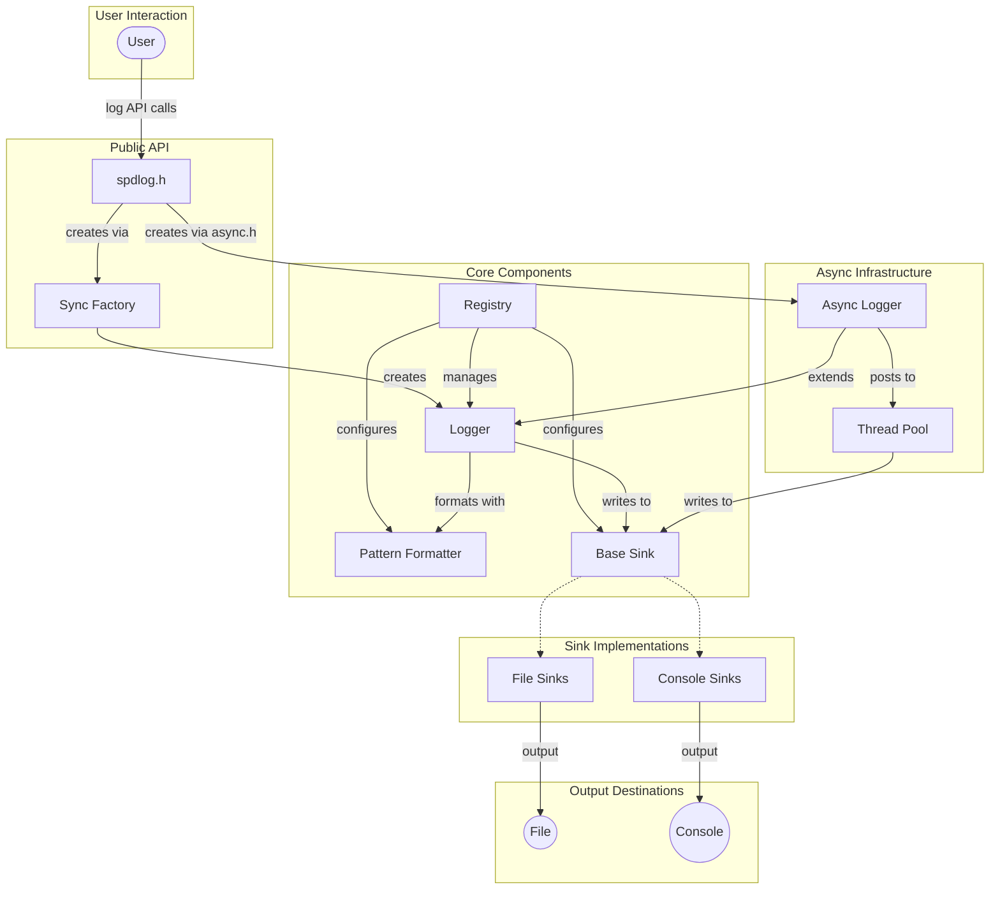
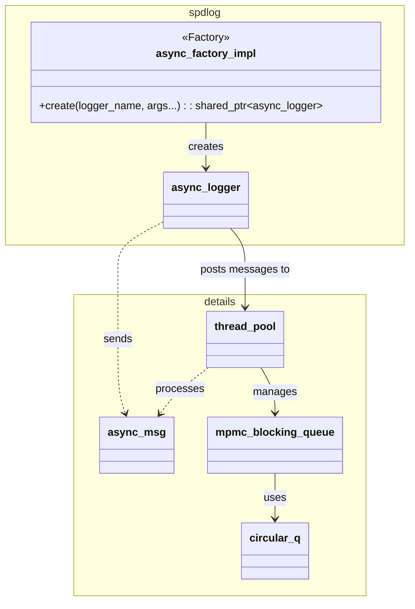
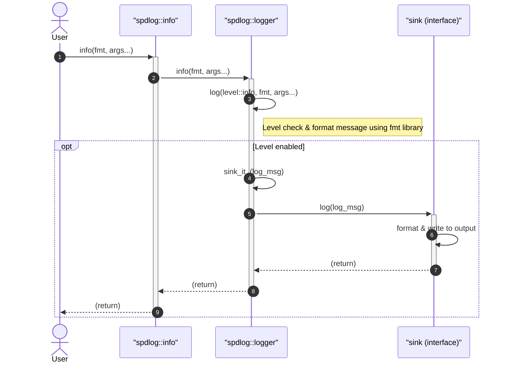
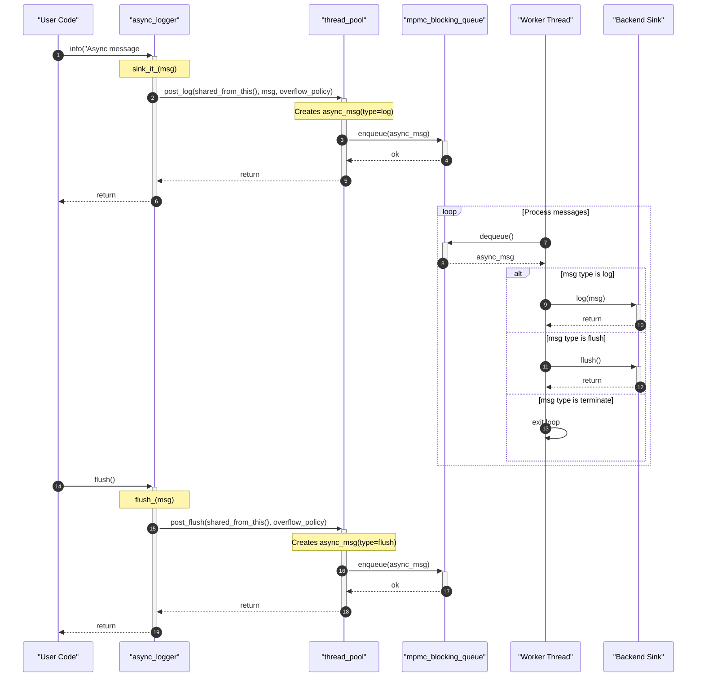
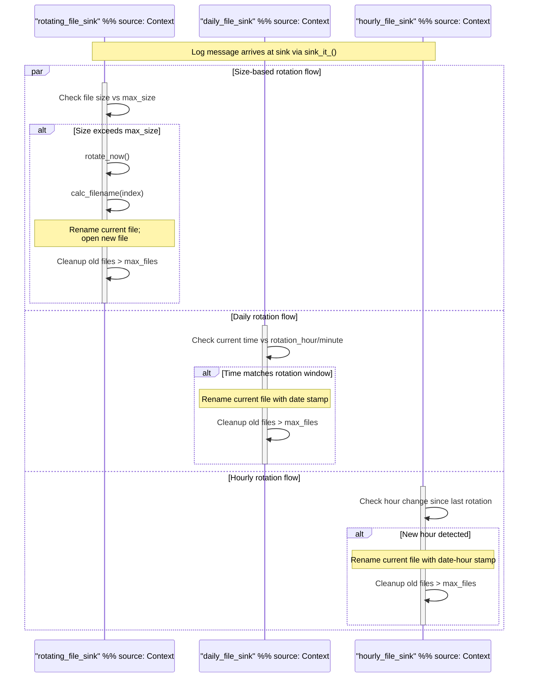
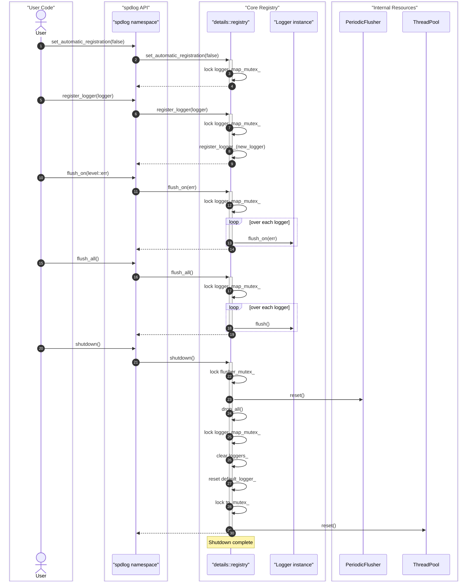

# spdlog Architecture


Fast C++ logging library providing a modular architecture for thread-safe log output with support for multiple sinks, custom formatting, and asynchronous logging.

## Architecture

spdlog is built around four primary components that work together to process log messages:

- **Loggers** – The public API through which applications send log messages. Each logger holds a name, a log level, a formatter, and a collection of sinks. The `logger` class (defined in `include/spdlog/logger.h`) manages level filtering, formatting, and dispatching messages to its sinks.
- **Sinks** – Output destinations for log messages. Each sink implements the `sink` interface (defined in `include/spdlog/sinks/sink.h`) and receives fully formatted messages. The library provides a variety of sink implementations for different outputs; see the [Sinks Reference](SINKS.md) for details.
- **Formatters** – Responsible for converting log messages into string output. The default `pattern_formatter` (in `include/spdlog/pattern_formatter.h`) supports configurable patterns with flags for time, level, logger name, message, and more. Custom formatters can be created by implementing the `formatter` interface. See [Custom Formatting](CUSTOM_FORMATTING.md) for details.
- **Registry** – A central registry (in `include/spdlog/details/registry.h`) that manages all logger instances, provides global configuration, and handles periodic flushing and thread pool lifecycle. It creates a default logger on initialization.

Messages flow through the system as follows:

1. An application calls a logging method on a logger (e.g., `logger->info("message")`).
2. The logger checks the message level against its configured threshold.
3. If the level passes, the logger formats the message using its formatter, producing a string.
4. The formatted message is passed to each attached sink, which writes it to its output destination.
5. For asynchronous loggers, the message is posted to a thread pool queue instead of being processed immediately. A background worker dequeues and forwards the message to the sinks.

The architecture supports both synchronous and asynchronous modes. Synchronous logging blocks the calling thread until the sink writes the message. Asynchronous logging uses a multi-producer, multi-consumer blocking queue (`mpmc_blocking_q`) and a thread pool (`thread_pool`) to decouple the logging call from the I/O operation, reducing latency in the calling thread.

The following diagrams illustrate the key components and their interactions:

```mermaid
classDiagram
    direction TB

    namespace sinks {
        class sink {
            <<Interface>>
            +log(msg: log_msg): void
            +flush(): void
            +set_pattern(pattern: string): void
            +set_formatter(formatter: unique_ptr): void
        }
        class rotating_file_sink {
            +rotating_file_sink(filename, max_size, max_files)
            +log(msg: log_msg): void
            +flush(): void
        }
        class daily_file_sink {
            +daily_file_sink(filename, rotation_hour, rotation_minute)
            +log(msg: log_msg): void
            +flush(): void
        }
        class stdout_sink_base {
            <<Abstract>>
            +log(msg: log_msg): void
            +flush(): void
        }
        class syslog_sink {
            +syslog_sink(ident, option, facility)
            +log(msg: log_msg): void
            +flush(): void
        }
        class tcp_sink {
            +tcp_sink(host, port)
            +log(msg: log_msg): void
            +flush(): void
        }
        class udp_sink {
            +udp_sink(host, port)
            +log(msg: log_msg): void
            +flush(): void
        }
        class kafka_sink {
            +kafka_sink(topic, config)
            +log(msg: log_msg): void
            +flush(): void
        }
        class ostream_sink {
            +ostream_sink(stream)
            +log(msg: log_msg): void
            +flush(): void
        }
        class systemd_sink {
            +systemd_sink()
            +log(msg: log_msg): void
            +flush(): void
        }
    }

    namespace async {
        class async_logger {
            +async_logger(name, sink, tp)
            +log(msg: log_msg): void
            +flush(): void
        }
        class thread_pool {
            +thread_pool(q_size, thread_count)
            +post_log(msg): void
            +post_flush(worker): void
        }
        class async_factory_impl {
            +create(logger_name, sink_args): shared_ptr
        }
    }

    namespace core {
        class logger {
            <<Abstract>>
            +log(level, msg): void
            +flush(): void
            +set_level(level): void
            +sinks(): vector~sink_ptr~
        }
        class registry {
            +instance(): registry
            +create(logger_name): shared_ptr
            +get(logger_name): shared_ptr
            +set_default_logger(logger): void
        }
        class file_event_handlers {
            +before_open: function
            +after_open: function
            +before_close: function
            +after_close: function
        }
    }

    rotating_file_sink ..|> sink : implements
    daily_file_sink ..|> sink : implements
    stdout_sink_base ..|> sink : implements
    syslog_sink ..|> sink : implements
    tcp_sink ..|> sink : implements
    udp_sink ..|> sink : implements
    kafka_sink ..|> sink : implements
    ostream_sink ..|> sink : implements
    systemd_sink ..|> sink : implements

    async_logger --> thread_pool : uses
    async_factory_impl --> async_logger : creates

    logger --> sink : has > 1

    registry --> logger : manages

    async_logger --|> logger : extends

    rotating_file_sink --> file_event_handlers : may use
    daily_file_sink --> file_event_handlers : may use

    async_factory_impl --> thread_pool : uses
```
















## Project Structure

```
spdlog/
├── include/spdlog/       # Core headers (public API)
│   ├── cfg/              # Configuration from environment and command-line arguments
│   ├── details/          # Internal implementation (registry, thread pool, file helpers, etc.)
│   ├── fmt/              # Formatting support (bundled fmt library and extensions)
│   ├── sinks/            # Output sink implementations (file, console, syslog, network, etc.)
│   ├── async.h           # Async logger factory
│   ├── async_logger.h    # Async logger class
│   ├── common.h          # Core types, log levels, source location
│   ├── formatter.h       # Formatter interface
│   ├── logger.h          # Logger class
│   ├── mdc.h             # Mapped Diagnostic Context
│   ├── pattern_formatter.h # Pattern-based formatter
│   ├── spdlog.h          # Main public API header
│   ├── stopwatch.h       # Stopwatch utility
│   └── version.h         # Version macros
├── src/                  # Compiled source files (for non-header-only builds)
├── example/              # Example usage code
├── tests/                # Test suite (Catch2-based)
├── bench/                # Performance benchmarks
└── scripts/              # Utility scripts (e.g., version extraction)
```

The `include/spdlog` directory contains all public headers. The `details/` subdirectory holds internal machinery such as the registry, thread pool, file helper, and OS utilities. The `sinks/` subdirectory provides a wide range of output destinations; for a complete list and configuration details, see the [Sinks Reference](SINKS.md). The `fmt/` directory includes the bundled fmt library and spdlog-specific formatting extensions (e.g., `bin_to_hex.h`, `chrono.h`). The `src/` directory contains compiled implementations for components that benefit from separate compilation (e.g., async logger, file sinks, color sinks). The `example/` directory demonstrates common usage patterns, and `tests/` provides comprehensive test coverage. For contribution guidelines, see [Contributing to spdlog](CONTRIBUTING.md). For a high-level API overview, see the [API Overview](API.md).