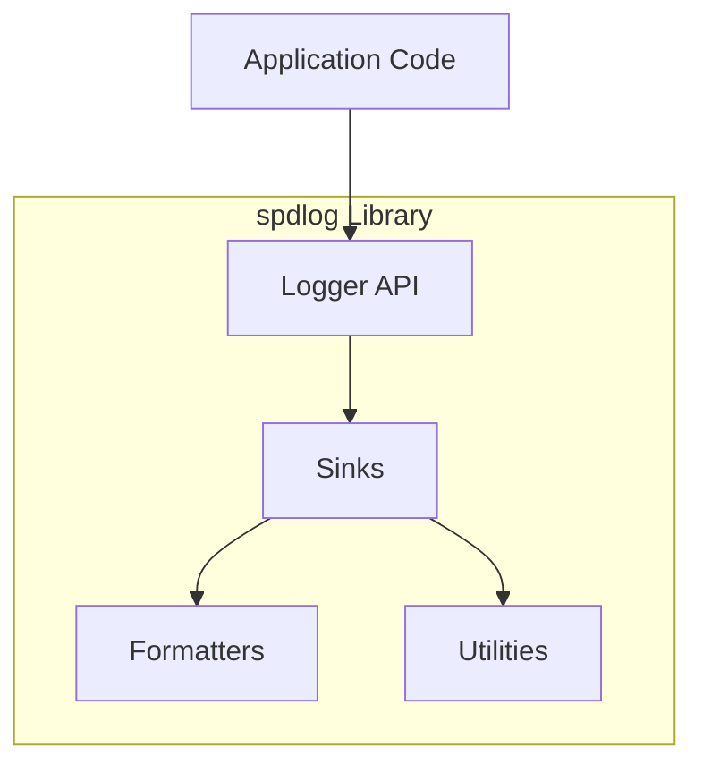

# spdlog

A fast C++ logging library.

## System Architecture

spdlog is designed as a standalone, header-only (or optionally compiled) library that provides a high-performance logging system for C++ applications. It does not rely on external service integrations or microservice communication patterns.

The architecture is monolithic within the library context, consisting of interconnected internal components rather than separate repositories.

## Services / Components

### Core Library (`spdlog`)
- **Logger API**: Provides the main interface for creating loggers, configuring log levels, and emitting log messages.
- **Sinks**: A collection of output destinations (e.g., console, file, rotating file, syslog, custom sinks).
- **Formatters**: Modules that define how log messages are formatted (e.g., pattern-based formatting).
- **Utilities**: Supporting functionality including thread-safety mechanisms, memory pools, and compile-time configuration.

## Communication Patterns

Since spdlog is a self-contained library, communication patterns are internal:

1. **In-Process Calls**: Direct C++ function calls between the logger API and sinks/formatters.
2. **Thread Safety**: Lock-free and atomic operations for concurrent logging from multiple threads.
3. **Buffer Management**: Efficient memory handling through internal buffers and memory pools.
4. **Compile-time Configuration**: Template-based design allowing static dispatch and customization at build time.

The library is typically integrated into applications by adding it as a header-only include or linking against a compiled library component. No network protocols or external APIs are involved in its core operation.