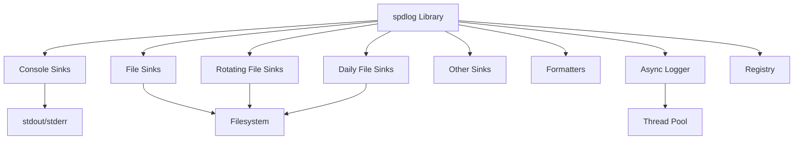

# spdlog

Fast C++ logging library.

## System Architecture

spdlog is a standalone library with no external service dependencies or sibling repositories. Its architecture is self-contained within a single repository.

## Services / Components

- **spdlog Library**: The core logging library providing a high-performance, header-only C++ logging solution. It offers various sink types, formatters, and logging patterns.

## Communication Patterns

spdlog is a library, not a service. It does not communicate over a network or with external services. All interactions occur within the same process:

- **API Calls**: User code directly calls spdlog API functions (e.g., `spdlog::info()`, `spdlog::error()`) to emit log messages.
- **Sink Output**: Log messages are written to configured sinks (console, files, etc.) via direct file I/O or standard stream operations.
- **Async Logging**: When using the async logger, messages are queued and processed by a background thread pool, enabling non-blocking log writes.