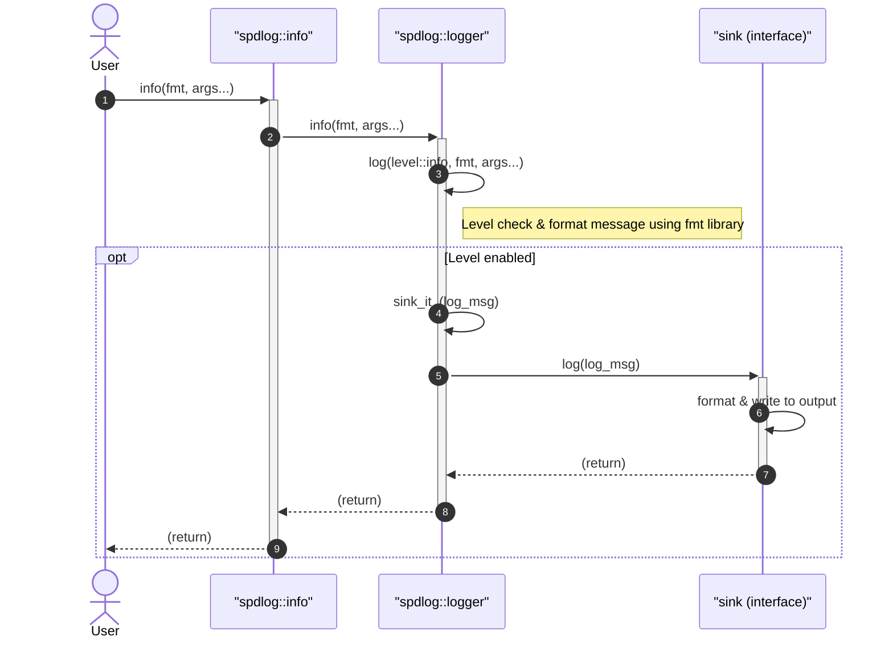
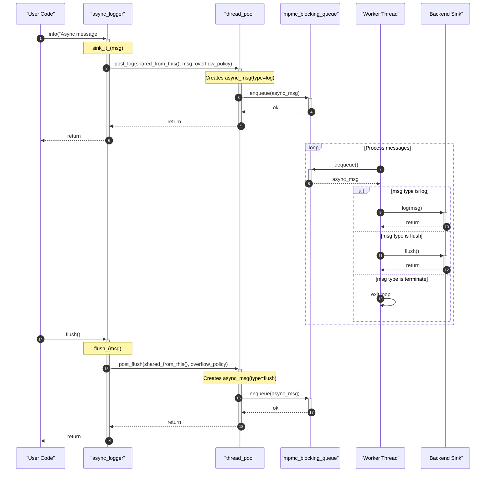

# spdlog Usage Guide


Fast C++ logging library.

spdlog is a header-only, high-performance C++ logging library that provides thread-safe logging, file rotation, pattern formatting, and asynchronous logging. It offers a simple API with multiple built-in sink types for console, file, syslog, and more. The library is designed for ease of integration and minimal overhead.

## Usage

The following examples demonstrate common logging patterns using spdlog.

### Basic Console Logging

```cpp
#include "spdlog/spdlog.h"
#include "spdlog/sinks/stdout_color_sinks.h"

int main() {
    // Create a console logger with colored output
    auto console = spdlog::stdout_color_mt("console");

    // Log messages at various levels
    console->info("Welcome to spdlog!");
    console->warn("This is a warning");
    console->error("Something went wrong: {}", 42);
}
```

Output (colored):
```
[2025-03-07 10:15:30.123] [console] [info] Welcome to spdlog!
[2025-03-07 10:15:30.124] [console] [warning] This is a warning
[2025-03-07 10:15:30.125] [console] [error] Something went wrong: 42
```

### File Logging with Rotation

```cpp
#include "spdlog/spdlog.h"
#include "spdlog/sinks/rotating_file_sink.h"

int main() {
    // Create a rotating file logger: max 5 MB per file, keep 3 files
    auto logger = spdlog::rotating_logger_mt("file_logger", "logs/app.log", 5 * 1024 * 1024, 3);

    for (int i = 0; i < 1000; ++i) {
        logger->info("Log entry number {}", i);
    }
}
```

### Asynchronous Logging

```cpp
#include "spdlog/spdlog.h"
#include "spdlog/async.h"
#include "spdlog/sinks/basic_file_sink.h"

int main() {
    // Use default thread pool settings
    spdlog::init_thread_pool(8192, 1);

    // Create an async file logger
    auto logger = spdlog::basic_logger_mt<spdlog::async_factory>("async_logger", "logs/async.log");

    logger->info("This message is logged asynchronously");
    logger->flush();  // Ensure all messages are written
}
```

### Pattern Formatting

```cpp
#include "spdlog/spdlog.h"
#include "spdlog/sinks/stdout_color_sinks.h"

int main() {
    auto logger = spdlog::stdout_color_mt("custom");
    // Set a custom pattern: timestamp, thread ID, level, message
    logger->set_pattern("[%Y-%m-%d %H:%M:%S.%e] [%t] [%^%l%$] %v");
    logger->info("Custom pattern applied");
}
```

For more advanced examples, see the [example/example.cpp](example/example.cpp) file and the [API Overview](API.md) document.

## Configuration

### Environment Variables

The library supports dynamic log-level configuration via environment variables (see `include/spdlog/cfg/env.h`). The variable `SPDLOG_LEVEL` can be set to a logger name and level (e.g., `my_logger=debug`). Multiple loggers can be separated by commas.

| Variable | Description | Example |
|----------|-------------|---------|
| `SPDLOG_LEVEL` | Set log level for specific loggers | `my_logger=info,other=warn` |

### Command-Line Arguments

Log levels can also be configured from command-line arguments using the utilities in `include/spdlog/cfg/argv.h`. This allows runtime overriding of log verbosity without recompilation.

### Pattern Format

The default pattern can be customized via `set_pattern()`. Common flags include:

| Flag | Description |
|------|-------------|
| `%Y-%m-%d` | Date |
| `%H:%M:%S.%e` | Time with milliseconds |
| `%t` | Thread ID |
| `%^...%$` | Color range |
| `%l` | Log level |
| `%v` | Actual message |

A full list of pattern flags is documented in [Custom Formatting in spdlog](CUSTOM_FORMATTING.md).

## Features

- **Thread-safe logging** – All loggers are thread-safe by default; single-threaded variants are available for extra performance.
- **Multiple sink types** – Built-in sinks for stdout/stderr (with colors), files (basic, rotating, daily, hourly), syslog, systemd journal, Android logcat, network (TCP/UDP), and more. See the [Sinks Reference](SINKS.md) for full details.
- **Asynchronous logging** – Log messages can be queued and processed by a dedicated thread pool, reducing latency on the caller side.
- **Pattern formatting** – Fully customizable output format with a rich set of flags for time, thread, source location, colors, and more.
- **Log level management** – Standard levels (trace, debug, info, warn, error, critical) and runtime level changes.
- **File rotation** – Automatic log file rotation based on file size or time (daily, hourly).
- **Logger registry** – Central management of logger instances via `spdlog::get()` and `spdlog::drop()`.
- **Backtrace support** – Store recent log messages in a circular buffer for post-mortem debugging.
- **Mapped Diagnostic Context (MDC)** – Thread-local context storage for adding contextual information to all log messages.
- **Header-only and compiled modes** – Can be used as a header-only library or compiled for faster build times.



*Figure: Flow of a synchronous log call from application to sink.*



*Figure: Flow of an asynchronous log call using a thread pool.*

For a deeper understanding of the architecture and design decisions, see the [Architecture Overview](ARCHITECTURE.md). For contributing guidelines, refer to [CONTRIBUTING.md](CONTRIBUTING.md).